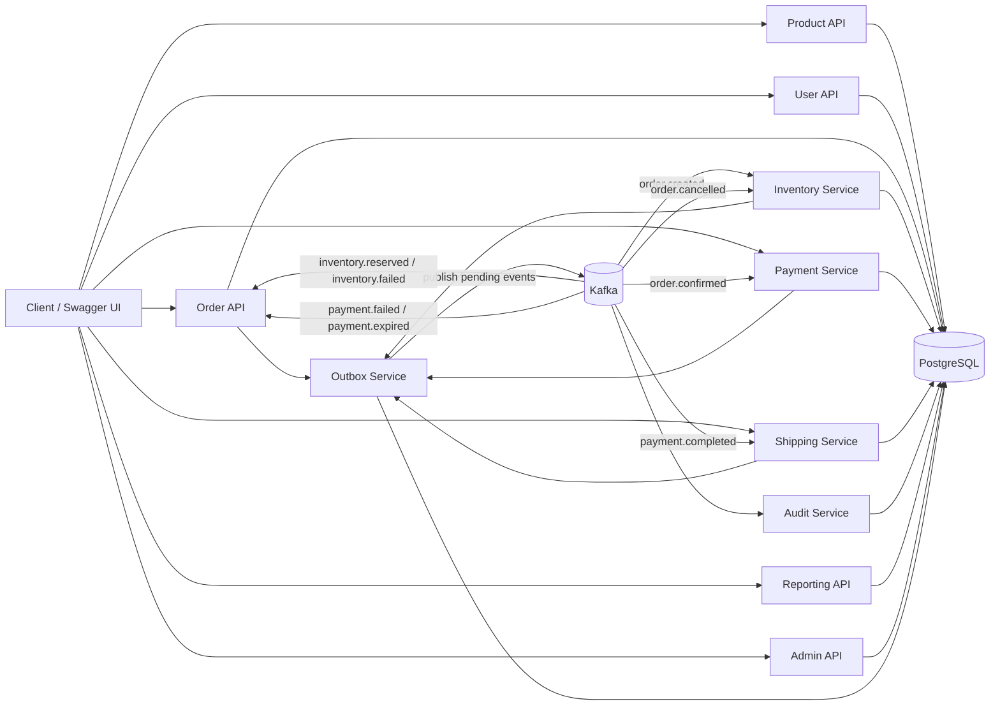
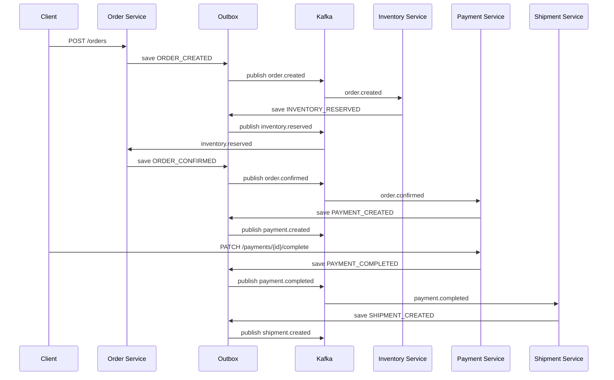
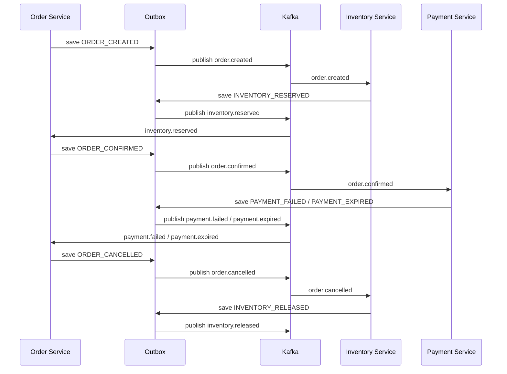

# OrderFlow
[](https://github.com/hhristov1980/reactive-orderflow-system/actions/workflows/ci-cd.yml)

OrderFlow is a reactive, event-driven order management platform built with Spring WebFlux, R2DBC, PostgreSQL, Kafka, Docker, and MapStruct.

It demonstrates a realistic e-commerce backend flow: product catalog management, users, order creation, inventory reservation, payment processing, shipping, audit logging, scheduled unpaid payment expiration, reporting, and operational admin views.

The project is currently implemented as a modular monolith with clear bounded contexts, making it suitable for later extraction into separate microservices.

---

## Main Goals

The project is designed to demonstrate:

* Reactive programming with Spring WebFlux and Project Reactor
* Non-blocking database access with R2DBC
* Event-driven communication with Apache Kafka
* Reliable event publishing through the Transactional Outbox Pattern
* Kafka consumer retries with dead-letter topics for failed records
* Saga-like order lifecycle coordination
* Concurrent-safe inventory updates with atomic SQL
* Idempotent inventory reservation handling for duplicate Kafka delivery
* Reactive transactional operations
* Parallel report aggregation with `Mono.zip(...)`
* Scheduled jobs for unpaid payment expiration
* Clean layered architecture
* DTO mapping with MapStruct
* Centralized validation and exception handling
* Operational admin APIs
* Dockerized local infrastructure
* GitHub Actions CI/CD with PostgreSQL and Kafka service containers
* Observability with Actuator, Micrometer, Prometheus, and Grafana

---

## Technology Stack

* Java 25
* Spring Boot
* Spring WebFlux
* Spring Data R2DBC
* PostgreSQL
* Apache Kafka
* Kafka UI
* Prometheus
* Grafana
* Docker Compose
* MapStruct
* Lombok
* SpringDoc OpenAPI / Swagger UI
* Spring Boot Actuator / Micrometer
* Maven

---

## High-Level Architecture

The application is currently implemented as a modular monolith with clear bounded contexts. Each context can later be extracted into a separate microservice.

### Main Contexts

* Product Service
* User Service
* Order Service
* Inventory Service
* Payment / Billing Service
* Shipping / Tracking Service
* Audit Service
* Outbox Service
* Admin Service
* Reporting Module

### Service Summary

| Service           | Responsibility                                                                                             |
| ----------------- | ---------------------------------------------------------------------------------------------------------- |
| Product Service   | Manages the product catalog and product availability metadata used when orders are created.                |
| User Service      | Manages users, user status, blocking, activation, and validation before order creation.                    |
| Order Service     | Owns order creation, order status transitions, order items, and saga coordination through outbox events.   |
| Inventory Service | Reads inventory, atomically reserves/releases stock, and tracks reservation state for idempotent retries.  |
| Payment Service   | Creates pending payments from confirmed orders, completes or fails payments, and expires overdue payments. |
| Shipment Service  | Creates shipments from completed payments and manages shipment progress from created to delivered.         |
| Audit Service     | Persists lifecycle events consumed from Kafka into the audit log for traceability.                         |
| Outbox Service    | Stores domain events transactionally and publishes pending events to Kafka with retry support.             |
| Report Service    | Provides read-only operational reports and dashboard aggregations from PostgreSQL.                         |
| Admin Service     | Aggregates dashboard data and exposes operational views for users, audit events, and outbox events.        |

### Package Structure

```text
com.order
├── application
│   ├── mapper
│   └── service
│       └── impl
├── domain
│   ├── dto
│   │   ├── request
│   │   └── response
│   │       ├── admin
│   │       └── report
│   ├── entity
│   ├── enums
│   └── event
├── exception
├── infrastructure
│   ├── config
│   │   ├── converter
│   │   └── properties
│   ├── messaging
│   │   └── kafka
│   ├── repository
│   │   ├── custom
│   │   └── report
│   └── scheduler
└── presentation
    └── controller
        └── admin
```

---

## Architecture Overview



### Runtime Layers

```text
Presentation layer
  REST controllers, request validation, OpenAPI annotations, centralized exception handling

Application layer
  Use-case services, reactive orchestration, transactions, DTO mapping

Domain layer
  Entities, enums, events, request/response DTOs

Infrastructure layer
  R2DBC repositories, custom SQL repositories, Kafka consumers, outbox publisher, schedulers, configuration
```

---

## Key Engineering Decisions

### Modular Monolith First

OrderFlow is intentionally implemented as a modular monolith. This keeps local development and deployment simple while still preserving clear bounded contexts around products, users, orders, inventory, payments, shipping, audit, reporting, and admin operations.

The package and service boundaries are designed so that individual contexts could later be extracted into separate services if operational needs justify the additional complexity.

### Transactional Outbox For Reliable Publishing

Business services do not publish directly to Kafka inside the main business flow. Instead, they persist domain events to `outbox_events` in the same reactive transaction as the related state change.

A scheduled publisher then publishes pending outbox events to Kafka and marks them as `PUBLISHED` or `FAILED`. This avoids the consistency problem where a database write succeeds but event publishing fails.

### Atomic SQL For Inventory Consistency

Inventory reservation uses conditional PostgreSQL updates instead of read-check-save logic. This keeps stock reservation safe under concurrent order creation because the availability check and quantity update happen in one atomic database operation.

### Idempotent Event Handling

Kafka consumers are designed to tolerate duplicate delivery. Inventory uses a reservation ledger with uniqueness constraints, and duplicate business events such as repeated `order.confirmed` or `payment.completed` messages are treated as already processed instead of creating duplicate payments or shipments.

### Reactive Composition Where It Adds Value

The project uses WebFlux, R2DBC, `Flux`, `Mono`, `TransactionalOperator`, and `Mono.zip(...)` to demonstrate non-blocking request handling, reactive database access, transactional orchestration, and parallel aggregation of independent report/admin queries.

### Operational Visibility

The admin, audit, outbox, reporting, metrics, Prometheus, and Grafana features are included to show how backend systems can be inspected and operated after business events have been processed.

---

## How to Run Locally

### 1. Start infrastructure

```bash
docker compose up -d
```

### 2. Verify containers

```bash
docker ps
```

Expected containers:

```text
postgres
kafka
kafka-ui
prometheus
grafana
```

### 3. Start the Spring Boot application

From the project root:

```bash
mvn spring-boot:run
```

Or run the main application class from the IDE.

### 4. Open tools

```text
Swagger UI: http://localhost:8081/swagger-ui.html
Kafka UI:   http://localhost:8080
Metrics:    http://localhost:8081/actuator/metrics
Prometheus: http://localhost:9090
Grafana:    http://localhost:3000
```

Grafana local credentials:

```text
Username: admin
Password: admin
```

---

## Metrics

Spring Boot Actuator exposes health, info, metrics, and Prometheus endpoints under `/actuator`.

Useful custom Kafka metrics:

* `orderflow.kafka.consumer.events` counts consumed Kafka records by `topic`, `outcome`, and `exception`.
  Outcomes are `success`, `duplicate`, and `failure`.
* `orderflow.kafka.dlt.events` counts records published to dead-letter topics by source topic, DLT topic, and exception.
* `orderflow.inventory.reservation.failures` counts inventory reservation failures that are converted into `inventory.failed` outbox events.

Examples:

```bash
curl http://localhost:8081/actuator/metrics/orderflow.kafka.consumer.events
curl http://localhost:8081/actuator/metrics/orderflow.kafka.dlt.events
curl http://localhost:8081/actuator/metrics/orderflow.inventory.reservation.failures
curl http://localhost:8081/actuator/prometheus
```

Prometheus is configured in `config/prometheus/prometheus.yml` to scrape the Spring Boot app at `host.docker.internal:8081/actuator/prometheus`.

Grafana is provisioned automatically with:

* Prometheus datasource: `config/grafana/provisioning/datasources/prometheus.yml`
* OrderFlow reliability dashboard: `config/grafana/dashboards/orderflow-observability.json`

---

## CI/CD

GitHub Actions workflow: `.github/workflows/ci-cd.yml`

The pipeline runs on:

* Pull requests to `main` or `master`
* Pushes to `main` or `master`
* Manual `workflow_dispatch`

The CI workflow validates the application against real infrastructure dependencies by starting PostgreSQL and Kafka as GitHub Actions service containers.

Pipeline stages:

```text
Checkout
   ↓
Set up JDK 25 with Maven cache
   ↓
Start PostgreSQL service container
   ↓
Start Kafka service container
   ↓
Run ./mvnw --batch-mode clean verify
   ↓
Upload test reports
   ↓
Upload packaged application JAR on main/master pushes
```

The workflow disables Spring Boot Docker Compose integration in CI and points the application to the GitHub Actions service containers:

```text
SPRING_DOCKER_COMPOSE_ENABLED=false
SPRING_R2DBC_URL=r2dbc:postgresql://localhost:5433/orderflow
SPRING_R2DBC_USERNAME=postgres
SPRING_R2DBC_PASSWORD=postgres
SPRING_KAFKA_BOOTSTRAP_SERVERS=localhost:9092
ORDERFLOW_KAFKA_BOOTSTRAP_SERVERS=localhost:9092
```

The current delivery step publishes the built JAR as a GitHub Actions artifact. A real deployment target can be added later when the hosting environment is chosen.

This CI/CD setup is intentionally lightweight but practical for a portfolio backend project: every pull request and main-branch change must compile, run tests, connect to PostgreSQL, connect to Kafka, and complete Maven verification successfully.

---

## Testing Strategy

The project includes automated tests focused on Kafka consumer retry and idempotency behavior.

Current test coverage demonstrates:

* Successful Kafka consumer processing
* Duplicate event handling
* Retry behavior for failed records
* Dead-letter topic handling for records that cannot be processed
* Idempotent handling of already-processed business events

The CI pipeline runs the test suite with:

```bash
./mvnw --batch-mode clean verify
```

The GitHub Actions workflow starts PostgreSQL and Kafka service containers before running Maven verification, so tests can be executed against infrastructure that is close to the local development setup.

Planned testing improvements:

* Testcontainers-based integration tests for PostgreSQL and Kafka
* Service-layer transaction tests for order, inventory, payment, and shipping flows
* Scheduler tests for unpaid payment expiration and outbox publishing
* Repository integration tests for custom SQL reporting queries
* Contract tests for Kafka event schemas before extracting bounded contexts into separate services

---

## Local Infrastructure

The project uses Docker Compose for local infrastructure.

### Services

* PostgreSQL
* Kafka
* Kafka UI
* Prometheus
* Grafana

### Ports

```text
PostgreSQL: 5433
Kafka:      9092
Kafka UI:   8080
Prometheus: 9090
Grafana:    3000
Application: 8081
```

---

## End-to-End Business Flow

### Happy Path



### Compensation Path



---

## Core Business Flow

### Order Creation Flow

```text
POST /api/v1/orders
   ↓
Order CREATED
   ↓
ORDER_CREATED outbox event
   ↓
OutboxPublisherScheduler publishes order.created
   ↓
Inventory reserves stock
   ↓
INVENTORY_RESERVED or INVENTORY_FAILED outbox event
```

If inventory is reserved successfully:

```text
inventory.reserved
   ↓
Order CONFIRMED
   ↓
ORDER_CONFIRMED outbox event
   ↓
OutboxPublisherScheduler publishes order.confirmed
   ↓
Payment PENDING is created
   ↓
PAYMENT_CREATED outbox event
```

If inventory reservation fails:

```text
inventory.failed
   ↓
Order FAILED
```

---

## Payment Flow

After an order is confirmed, a payment is created with status `PENDING`.

```text
order.confirmed
   ↓
PaymentOrderConfirmedConsumer
   ↓
Payment PENDING
   ↓
PAYMENT_CREATED outbox event
   ↓
payment.created
```

Payment can then be completed manually:

```text
PATCH /api/v1/payments/{id}/complete
   ↓
Payment COMPLETED
   ↓
PAYMENT_COMPLETED outbox event
   ↓
payment.completed
   ↓
Shipment CREATED
```

Or failed manually:

```text
PATCH /api/v1/payments/{id}/fail
   ↓
Payment FAILED
   ↓
PAYMENT_FAILED outbox event
   ↓
payment.failed
   ↓
Order CANCELLED
   ↓
ORDER_CANCELLED outbox event
   ↓
order.cancelled
   ↓
Inventory RELEASED
```

---

## Scheduled Payment Expiration

The system includes a scheduler that expires unpaid payments after a configured number of days.

```text
Payment PENDING
   ↓ after configured expiration period
UnpaidPaymentScheduler
   ↓
Payment EXPIRED
   ↓
PAYMENT_EXPIRED outbox event
   ↓
payment.expired
   ↓
Order CANCELLED
   ↓
ORDER_CANCELLED outbox event
   ↓
order.cancelled
   ↓
Inventory RELEASED
```

Example configuration:

```yaml
orderflow:
  scheduler:
    unpaid-payments:
      enabled: true
      expiration-days: 3
      fixed-delay-ms: 3600000
```

For local testing:

```yaml
orderflow:
  scheduler:
    unpaid-payments:
      enabled: true
      expiration-days: 0
      fixed-delay-ms: 30000
```

---

## Shipping Flow

Shipping starts only after payment is completed.

```text
payment.completed
   ↓
PaymentEventConsumer
   ↓
Shipment CREATED
   ↓
SHIPMENT_CREATED outbox event
   ↓
shipment.created
```

Shipment status transitions:

```text
CREATED -> SHIPPED -> DELIVERED
```

Each shipment transition is also published through the outbox:

```text
SHIPMENT_CREATED   -> shipment.created
SHIPMENT_SHIPPED   -> shipment.shipped
SHIPMENT_DELIVERED -> shipment.delivered
```

Endpoints:

```http
GET   /api/v1/shipments/{id}
GET   /api/v1/shipments/orders/{orderId}
PATCH /api/v1/shipments/{id}/ship
PATCH /api/v1/shipments/{id}/deliver
```

---

## Inventory Flow

Inventory is the source of truth for available and reserved stock.

Inventory mutations are concurrency-safe at the database level. Reservation and release operations use conditional PostgreSQL updates instead of read-check-save logic:

```sql
UPDATE inventory
SET available_quantity = available_quantity - :quantity,
    reserved_quantity = reserved_quantity + :quantity
WHERE product_id = :productId
  AND available_quantity >= :quantity;
```

The row update and stock check happen atomically, so two concurrent orders cannot both reserve the same available units.

Inventory also keeps an `inventory_reservations` ledger with a unique `(order_id, product_id)` constraint. This protects the service from duplicate Kafka deliveries:

```text
Duplicate order.created
   ↓
inventory_reservations insert conflicts
   ↓
stock is not reserved a second time
```

Duplicate `order.cancelled` events are also idempotent: if the matching reservation is already marked `RELEASED`, the service returns the release event without moving stock again.

### Reservation

```text
order.created
   ↓
InventoryOrderEventConsumer
   ↓
insert inventory_reservations row
   ↓
reserve inventory items
   ↓
INVENTORY_RESERVED or INVENTORY_FAILED outbox event
   ↓
inventory.reserved or inventory.failed
```

### Release

```text
order.cancelled
   ↓
InventoryOrderEventConsumer
   ↓
mark inventory_reservations row as RELEASED
   ↓
release reserved inventory
   ↓
INVENTORY_RELEASED outbox event
   ↓
inventory.released
```

The system uses reactive composition to process order items:

```java
Flux.fromIterable(event.items())
    .flatMap(this::reserveSingleItem)
    .collectList();
```

---

## Kafka Topics

### Order Topics

```text
order.created
order.confirmed
order.cancelled
```

### Inventory Topics

```text
inventory.reserved
inventory.failed
inventory.released
```

### Payment Topics

```text
payment.created
payment.completed
payment.failed
payment.expired
```

### Shipment Topics

```text
shipment.created
shipment.shipped
shipment.delivered
```

---

## Kafka Consumer Groups

```yaml
orderflow:
  kafka:
    consumer-groups:
      audit: orderflow-audit-service
      inventory: orderflow-inventory-service
      order: orderflow-order-service
      shipment: orderflow-shipment-service
      payment: orderflow-payment-service
```

Different consumer groups allow multiple bounded contexts to react to the same event independently.

For example, both Audit and Inventory consume `order.created`, but they use different consumer groups.

Kafka listeners wait for their reactive database and outbox work to finish before returning to the container. This keeps Kafka retry semantics aligned with the actual processing result: if the database write or outbox save fails, the listener throws and the container retry policy handles the record.

Duplicate business events that are already safely handled by database constraints are treated as processed. For example, duplicate `order.confirmed` events do not create a second payment, and duplicate `payment.completed` events do not create a second shipment.

---

## Kafka Retry And DLT

Kafka consumer failures use a bounded retry policy:

```text
process record
   ↓
retry after 1 second
   ↓
retry after 1 second
   ↓
retry after 1 second
   ↓
publish original record to <topic>.DLT
```

Invalid payloads are not retried. They are treated as non-retryable and are sent to the matching dead-letter topic immediately.

Dead-letter topics are created for each application topic using the `<topic>.DLT` naming convention, for example:

```text
order.created.DLT
inventory.reserved.DLT
payment.completed.DLT
```

---

## Kafka Topic Creation

Kafka topics are declared through Spring Kafka topic configuration instead of relying only on broker auto-creation.

Example configuration:

```yaml
orderflow:
  kafka:
    topic-settings:
      partitions: 1
      replicas: 1
```

For local development, one partition and one replica are sufficient because the Docker setup uses a single Kafka broker.

---

## Transactional Outbox Pattern

Business services write domain events to `outbox_events` inside the same reactive transaction as the related state change.

This prevents the common consistency problem where a database change succeeds, but the Kafka publish fails.

```text
Business transaction
   ↓
Save aggregate changes
   ↓
Save outbox event in the same transaction
   ↓
Commit
   ↓
OutboxPublisherScheduler polls publishable events
   ↓
Publish to Kafka
   ↓
Mark event as PUBLISHED or FAILED
```

The following lifecycle events are published through the outbox:

```text
ORDER_CREATED
ORDER_CONFIRMED
ORDER_CANCELLED

INVENTORY_RESERVED
INVENTORY_FAILED
INVENTORY_RELEASED

PAYMENT_CREATED
PAYMENT_COMPLETED
PAYMENT_FAILED
PAYMENT_EXPIRED

SHIPMENT_CREATED
SHIPMENT_SHIPPED
SHIPMENT_DELIVERED
```

Outbox publishing is configurable:

```yaml
orderflow:
  scheduler:
    outbox:
      enabled: true
      fixed-delay-ms: 5000
      max-retries: 5
```

Failed outbox events can be inspected and manually retried through the admin API.

Only `FAILED` outbox events can be manually retried to avoid duplicate publishing of already `PUBLISHED` events.

---

## Reporting Module

The reporting module is read-only and uses custom SQL aggregation queries via `DatabaseClient`.

### Report Endpoints

```http
GET /api/v1/reports/orders/summary
GET /api/v1/reports/revenue
GET /api/v1/reports/inventory
GET /api/v1/reports/payments
GET /api/v1/reports/top-products
GET /api/v1/reports/dashboard
```

### Dashboard Report

The dashboard combines independent report queries in parallel using `Mono.zip(...)`:

```java
Mono.zip(
    ordersMono,
    revenueMono,
    inventoryMono,
    paymentsMono,
    topProductsMono
)
```

This demonstrates one of the practical advantages of reactive programming: independent non-blocking operations can be composed and resolved together.

---

## Admin Module

The admin module exposes operational views over the system without taking ownership of the core business workflows.

### Admin Dashboard

```http
GET /api/v1/admin/dashboard
```

The dashboard is served by `AdminService` and combines order, payment, revenue, inventory, top-product, and outbox summaries through parallel repository calls.

### Admin Audit Events

`AdminAuditController` exposes paged access to stored audit events:

```http
GET /api/v1/admin/audit-events
GET /api/v1/admin/audit-events/{id}
GET /api/v1/admin/audit-events/orders/{orderId}
```

These endpoints are read-only and delegate to `AdminService`, which reads `audit_events`, validates page and size limits, and returns `PagedResponse<AuditEventResponse>`.

### Admin Outbox Events

```http
GET   /api/v1/admin/outbox-events
GET   /api/v1/admin/outbox-events/{id}
PATCH /api/v1/admin/outbox-events/{id}/retry
```

Outbox events can be listed, filtered by status, inspected by id, and manually moved from `FAILED` back to `PENDING` for retry.

Only `FAILED` events can be retried manually.

### Admin User Actions

```http
PATCH /api/v1/admin/users/{id}/block
PATCH /api/v1/admin/users/{id}/activate
```

These endpoints reuse `UserService` so administrative status changes follow the same validation rules as the rest of the user domain.

---

## Main REST API Overview

### Products

```http
POST   /api/v1/products
GET    /api/v1/products
GET    /api/v1/products/{id}
PUT    /api/v1/products/{id}
DELETE /api/v1/products/{id}
```

### Users

```http
POST   /api/v1/users
GET    /api/v1/users
GET    /api/v1/users/{id}
PUT    /api/v1/users/{id}
DELETE /api/v1/users/{id}
```

### Orders

```http
POST  /api/v1/orders
GET   /api/v1/orders
GET   /api/v1/orders/{id}
PATCH /api/v1/orders/{id}/cancel
```

### Inventory

```http
GET /api/v1/inventory/products
GET /api/v1/inventory/products/{productId}
```

### Payments

```http
GET   /api/v1/payments/{id}
GET   /api/v1/payments/orders/{orderId}
PATCH /api/v1/payments/{id}/complete
PATCH /api/v1/payments/{id}/fail
```

### Shipments

```http
GET   /api/v1/shipments/{id}
GET   /api/v1/shipments/orders/{orderId}
PATCH /api/v1/shipments/{id}/ship
PATCH /api/v1/shipments/{id}/deliver
```

### Reports

```http
GET /api/v1/reports/orders/summary
GET /api/v1/reports/revenue
GET /api/v1/reports/inventory
GET /api/v1/reports/payments
GET /api/v1/reports/top-products
GET /api/v1/reports/dashboard
```

### Admin

```http
GET   /api/v1/admin/dashboard
GET   /api/v1/admin/audit-events
GET   /api/v1/admin/audit-events/{id}
GET   /api/v1/admin/audit-events/orders/{orderId}
GET   /api/v1/admin/outbox-events
GET   /api/v1/admin/outbox-events/{id}
PATCH /api/v1/admin/outbox-events/{id}/retry
PATCH /api/v1/admin/users/{id}/block
PATCH /api/v1/admin/users/{id}/activate
```

---

## Order Lifecycle

Current order statuses:

```text
CREATED
CONFIRMED
CANCELLED
FAILED
```

Main transitions:

```text
CREATED -> CONFIRMED      when inventory is reserved
CREATED -> FAILED         when inventory reservation fails
CONFIRMED -> CANCELLED    when payment fails or expires
CONFIRMED -> CANCELLED    when order is manually cancelled
```

---

## Payment Lifecycle

Payment statuses:

```text
PENDING
COMPLETED
FAILED
EXPIRED
```

Main transitions:

```text
PENDING -> COMPLETED
PENDING -> FAILED
PENDING -> EXPIRED
```

---

## Shipment Lifecycle

Shipment statuses:

```text
CREATED
SHIPPED
DELIVERED
CANCELLED
```

Main transitions:

```text
CREATED -> SHIPPED -> DELIVERED
```

---

## User Lifecycle

User roles:

```text
CUSTOMER
ADMIN
```

User statuses:

```text
ACTIVE
BLOCKED
DELETED
```

Blocked or deleted users cannot create new orders.

Admin endpoints can block or reactivate users.

---

## Reactive Highlights

### Parallel Inventory Reservation

Inventory reservation processes order items reactively:

```java
Flux.fromIterable(event.items())
    .flatMap(this::reserveSingleItem)
    .collectList();
```

### Parallel Dashboard Aggregation

Dashboard reporting combines independent queries with `Mono.zip(...)`:

```java
return Mono.zip(
        ordersMono,
        revenueMono,
        inventoryMono,
        paymentsMono,
        topProductsMono
)
.map(tuple -> new DashboardReportResponse(...));
```

### Parallel Admin Dashboard Aggregation

The admin dashboard also combines multiple independent operational queries:

```java
return Mono.zip(
        ordersMono,
        paymentsMono,
        revenueMono,
        inventoryMono,
        topProductsMono,
        outboxMono
)
.map(tuple -> new AdminDashboardResponse(...));
```

### Reactive Transactions

Important business operations are wrapped in reactive transactions using `TransactionalOperator`.

Examples:

* order creation
* inventory reservation
* inventory release
* inventory reservation idempotency
* order confirmation from inventory event
* order cancellation from payment failure
* payment creation
* payment completion
* payment failure
* payment expiration
* shipment creation
* shipment shipping
* shipment delivery

---

## Audit Logging

The Audit Service listens to lifecycle events and stores them in the `audit_events` table.

Examples:

```text
ORDER_CREATED
ORDER_CONFIRMED
ORDER_CANCELLED
```

The audit log stores:

```text
event_type
aggregate_type
aggregate_id
payload
created_at
```

Audit events can be inspected through admin endpoints.

---

## Configuration Philosophy

The project avoids hardcoded infrastructure settings.

Kafka topics, consumer groups, topic settings, report limits, scheduler settings, and other configurable values are defined in `application.yaml` and loaded through `@ConfigurationProperties` classes.

Examples:

```yaml
orderflow:
  kafka:
    bootstrap-servers: localhost:9092
    topic-settings:
      partitions: 1
      replicas: 1
```

```yaml
orderflow:
  reports:
    dashboard:
      top-products-limit: 5
```

```yaml
orderflow:
  scheduler:
    unpaid-payments:
      enabled: true
      expiration-days: 3
      fixed-delay-ms: 3600000
    outbox:
      enabled: true
      fixed-delay-ms: 5000
      max-retries: 5
```

For Kubernetes or production-like environments, these values can be overridden through environment variables while local defaults remain usable for development.

---

## Example End-to-End Happy Path

```text
1. Create products and users
2. Create inventory records for products
3. Create an order
4. ORDER_CREATED is saved to the outbox
5. OutboxPublisherScheduler publishes order.created
6. Inventory creates reservation ledger rows and atomically reserves stock
7. INVENTORY_RESERVED is saved to the outbox
8. OutboxPublisherScheduler publishes inventory.reserved
9. Order status becomes CONFIRMED
10. ORDER_CONFIRMED is saved to the outbox
11. Payment is created with PENDING status
12. PAYMENT_CREATED is saved to the outbox
13. Payment is completed manually
14. PAYMENT_COMPLETED is saved to the outbox
15. Shipment is created
16. SHIPMENT_CREATED is saved to the outbox
17. Shipment is marked as SHIPPED
18. Shipment is marked as DELIVERED
19. Open reporting dashboard
20. Open admin dashboard
21. Inspect outbox events
22. Inspect audit events for the created order
```

---

## Example Failure / Compensation Path

```text
1. Create an order
2. Inventory creates reservation ledger rows and atomically reserves stock
3. Payment is created with PENDING status
4. Payment fails or expires
5. PAYMENT_FAILED or PAYMENT_EXPIRED is saved to the outbox
6. OutboxPublisherScheduler publishes payment.failed or payment.expired
7. Order is cancelled
8. ORDER_CANCELLED is saved to the outbox
9. OutboxPublisherScheduler publishes order.cancelled
10. Inventory marks reservation ledger rows as RELEASED and atomically releases stock
11. INVENTORY_RELEASED is saved to the outbox
12. OutboxPublisherScheduler publishes inventory.released
13. Check audit events for the cancelled order
14. Check outbox events and confirm all related events are PUBLISHED
```

---

## Portfolio Highlights

This project demonstrates several backend engineering concepts that are useful in real-world systems:

* Reactive REST APIs with WebFlux
* Non-blocking PostgreSQL access with R2DBC
* Event-driven business workflows with Kafka
* Transactional Outbox Pattern for reliable event publishing
* Saga-like compensation through events
* Concurrent-safe inventory reservation and release logic
* Idempotent handling of duplicate inventory events
* Payment expiration through scheduled jobs
* Reporting read models with custom SQL
* Parallel dashboard aggregation with `Mono.zip(...)`
* Operational admin APIs for outbox and audit inspection
* Centralized configuration through `application.yaml`
* Modular monolith structure ready for microservice extraction
* GitHub Actions CI/CD with PostgreSQL and Kafka service containers

---

## Recommended Demo Scenario

A good demo sequence for the project is:

```text
1. Create products and users
2. Create inventory records for products
3. Create an order
4. Watch ORDER_CREATED in outbox_events
5. Watch order.created in Kafka UI
6. Watch INVENTORY_RESERVED and ORDER_CONFIRMED through outbox_events
7. Check payment PENDING
8. Complete payment manually
9. Watch PAYMENT_COMPLETED and SHIPMENT_CREATED through outbox_events
10. Mark shipment as SHIPPED and DELIVERED
11. Open reporting dashboard
12. Open admin dashboard
13. Inspect outbox events
14. Inspect audit events for the created order
```

Failure scenario:

```text
1. Create an order
2. Let payment stay PENDING
3. Scheduler expires the payment
4. PAYMENT_EXPIRED is saved to the outbox
5. payment.expired is published
6. Order is cancelled
7. Inventory marks reservation ledger rows as RELEASED and releases stock
8. Check audit events for the cancelled order
9. Check outbox events and confirm all related events are PUBLISHED
```

---

## Current Limitations And Production Notes

This project is production-inspired, but it is still a portfolio project and not a complete production system.

Current intentional limitations:

* Authentication and authorization are not implemented yet.
* Admin endpoints are separated by route and service boundaries, but they are not protected by Spring Security yet.
* The application currently runs as a single modular monolith deployment.
* Kafka topics use one partition and one replica in local development.
* The current CI/CD workflow builds, tests, and publishes a JAR artifact, but it does not deploy to a live hosting environment.
* Distributed tracing and correlation IDs across HTTP, Kafka, outbox, and database operations are planned but not yet implemented.
* Testcontainers-based full integration testing is planned as a next step.

These limitations are documented explicitly because the main purpose of the project is to demonstrate backend architecture, reliability patterns, reactive programming, event-driven workflows, and operational visibility.

---

## Build Status

The project is verified by GitHub Actions on every push and pull request to `main`.

The CI workflow starts PostgreSQL and Kafka service containers, disables local Docker Compose integration, runs Maven `clean verify`, uploads test reports, and publishes the application JAR artifact on successful pushes.

## Future Improvements

Potential next steps:

* Integration tests with Testcontainers
* Separate modules or microservices per bounded context
* Authentication and authorization with Spring Security
* More advanced reporting and time-based analytics
* Distributed tracing with correlation ids across HTTP, outbox, Kafka, and database work
* Admin workflow for inspecting, replaying, or parking records from dead-letter topics
* Stronger test coverage for service-layer transactions, scheduler behavior, and admin APIs
* Contract tests for Kafka event schemas before extracting bounded contexts into services

---

## Current Status


Implemented:

* Product CRUD
* User CRUD
* User role and status management
* Admin user block and activate actions
* Order lifecycle
* Inventory reservation and release
* Atomic inventory stock updates
* Inventory reservation ledger for duplicate event protection
* Payment lifecycle
* Scheduled payment expiration
* Shipping lifecycle
* Kafka consumer flows
* Kafka consumer retry and dead-letter topics
* Reliable Kafka publishing through transactional outbox
* Outbox event persistence and scheduled publishing
* Outbox retry support
* Audit event persistence
* Admin dashboard
* Admin audit and outbox endpoints
* Reporting dashboard
* Top products report
* Spring Boot Actuator metrics endpoint
* Custom Micrometer metrics for Kafka consumer outcomes, DLT publishing, and inventory reservation failures
* Prometheus scrape configuration
* Grafana datasource provisioning and OrderFlow reliability dashboard
* GitHub Actions CI/CD workflow for Maven verification and JAR artifact publishing
* Automated tests for Kafka consumer retry/idempotency behavior
* Swagger/OpenAPI support
* Docker-based local infrastructure
