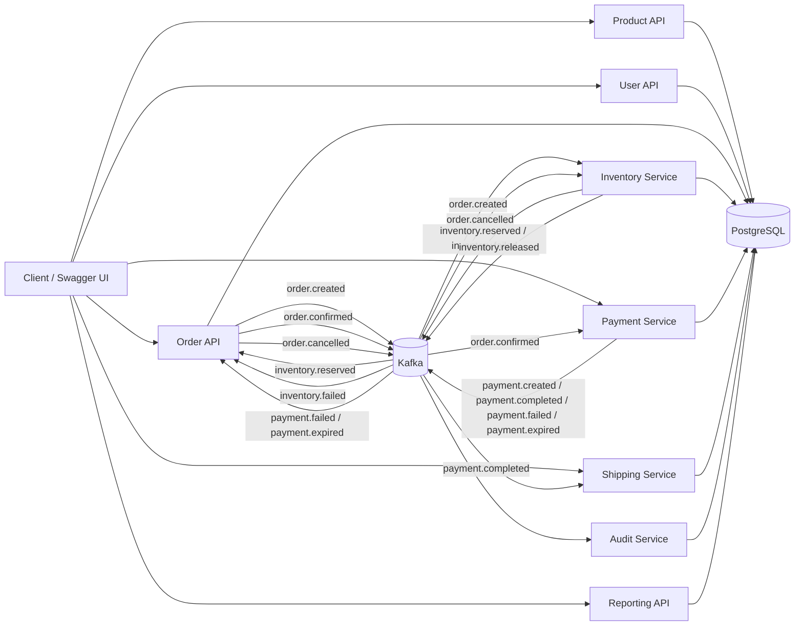
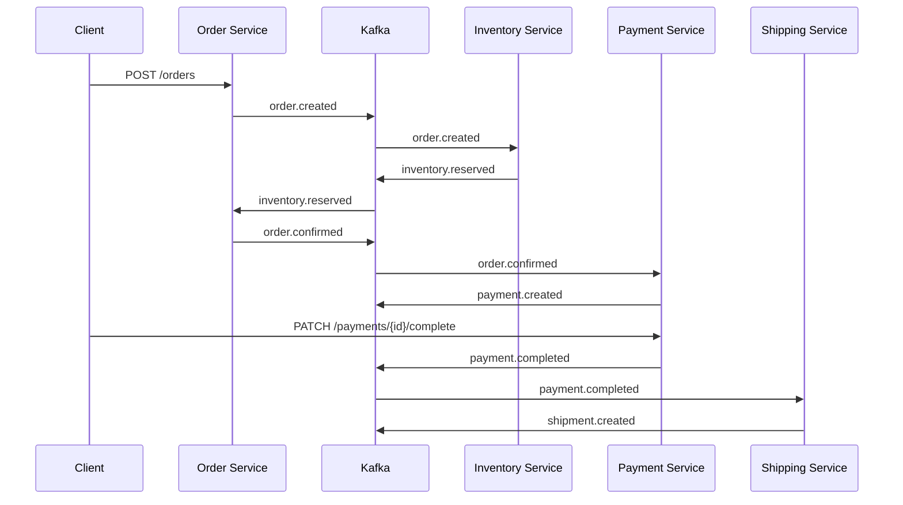
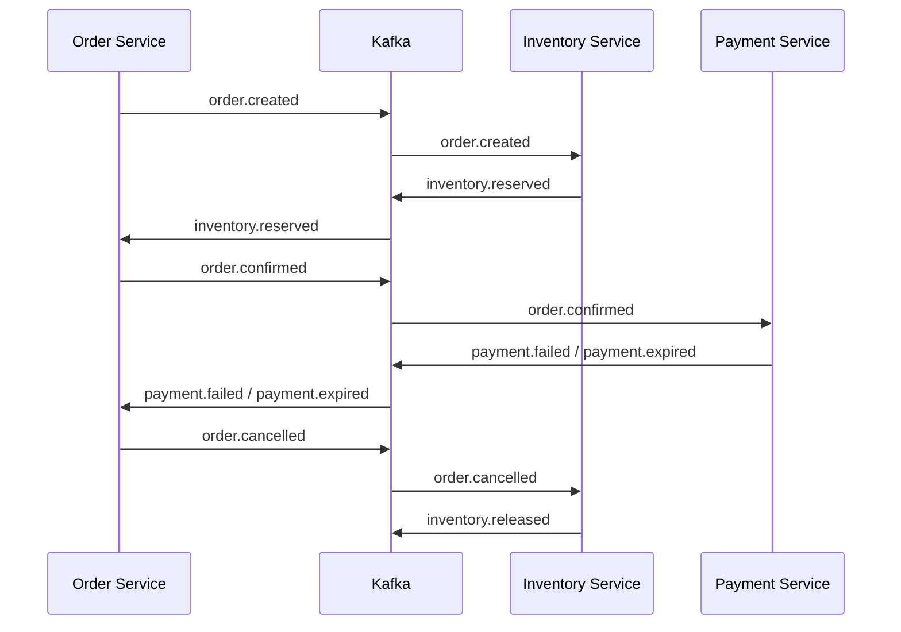

# OrderFlow

OrderFlow is a reactive, event-driven order management platform built with Spring WebFlux, R2DBC, PostgreSQL, Kafka, Docker, and MapStruct.

It demonstrates a realistic e-commerce backend flow: product catalog management, users, order creation, inventory reservation, payment processing, shipping, audit logging, scheduled unpaid payment expiration, and reporting.

The project is currently implemented as a modular monolith with clear bounded contexts, making it suitable for later extraction into separate microservices.

---

## Main Goals

The project is designed to demonstrate:

* Reactive programming with Spring WebFlux and Project Reactor
* Non-blocking database access with R2DBC
* Event-driven communication with Apache Kafka
* Saga-like order lifecycle coordination
* Reactive transactional operations
* Parallel report aggregation with `Mono.zip(...)`
* Scheduled jobs for unpaid payment expiration
* Clean layered architecture
* DTO mapping with MapStruct
* Centralized validation and exception handling
* Dockerized local infrastructure

---

## Technology Stack

* Java
* Spring Boot
* Spring WebFlux
* Spring Data R2DBC
* PostgreSQL
* Apache Kafka
* Kafka UI
* Docker Compose
* MapStruct
* Lombok
* SpringDoc OpenAPI / Swagger UI
* Maven

---

## High-Level Architecture

The application is currently implemented as a modular monolith with clear bounded contexts. Each context can later be extracted into a separate microservice.

### Main Contexts

* Product Service
* User Service
* Order Service
* Inventory Service
* Payment / Billing Service
* Shipping / Tracking Service
* Audit Service
* Reporting Module

### Package Structure

```text
com.order
├── application
│   ├── mapper
│   └── service
│       └── impl
├── domain
│   ├── dto
│   │   ├── request
│   │   └── response
│   │       └── report
│   ├── entity
│   ├── enums
│   └── event
├── exception
├── infrastructure
│   ├── config
│   │   ├── converter
│   │   └── properties
│   ├── messaging
│   │   └── kafka
│   ├── repository
│   │   ├── custom
│   │   └── report
│   └── scheduler
└── presentation
    └── controller
```

---

## Architecture Overview



---

## How to Run Locally

### 1. Start infrastructure

```bash
docker compose up -d
```

### 2. Verify containers

```bash
docker ps
```

Expected containers:

```text
postgres
kafka
kafka-ui
```

### 3. Start the Spring Boot application

From the project root:

```bash
mvn spring-boot:run
```

Or run the main application class from the IDE.

### 4. Open tools

```text
Swagger UI: http://localhost:8081/swagger-ui.html
Kafka UI:   http://localhost:8080
```

---

## Local Infrastructure

The project uses Docker Compose for local infrastructure.

### Services

* PostgreSQL
* Kafka
* Kafka UI

### Ports

```text
PostgreSQL: 5433
Kafka:      9092
Kafka UI:   8080
Application: 8081
```

---

## End-to-End Business Flow

### Happy Path



### Compensation Path



---

## Core Business Flow

### Order Creation Flow

```text
POST /api/v1/orders
   ↓
Order CREATED
   ↓
order.created event
   ↓
Inventory reserves stock
   ↓
inventory.reserved OR inventory.failed
```

If inventory is reserved successfully:

```text
inventory.reserved
   ↓
Order CONFIRMED
   ↓
order.confirmed event
   ↓
Payment PENDING is created
   ↓
payment.created event
```

If inventory reservation fails:

```text
inventory.failed
   ↓
Order FAILED
```

---

## Payment Flow

After an order is confirmed, a payment is created with status `PENDING`.

```text
order.confirmed
   ↓
PaymentOrderConfirmedConsumer
   ↓
Payment PENDING
   ↓
payment.created
```

Payment can then be completed manually:

```text
PATCH /api/v1/payments/{id}/complete
   ↓
Payment COMPLETED
   ↓
payment.completed
   ↓
Shipment CREATED
```

Or failed manually:

```text
PATCH /api/v1/payments/{id}/fail
   ↓
Payment FAILED
   ↓
payment.failed
   ↓
Order CANCELLED
   ↓
order.cancelled
   ↓
Inventory RELEASED
```

---

## Scheduled Payment Expiration

The system includes a scheduler that expires unpaid payments after a configured number of days.

```text
Payment PENDING
   ↓ after configured expiration period
Scheduler
   ↓
Payment EXPIRED
   ↓
payment.expired
   ↓
Order CANCELLED
   ↓
order.cancelled
   ↓
Inventory RELEASED
```

Example configuration:

```yaml
orderflow:
  scheduler:
    unpaid-payments:
      enabled: true
      expiration-days: 3
      fixed-delay-ms: 3600000
```

For local testing:

```yaml
orderflow:
  scheduler:
    unpaid-payments:
      enabled: true
      expiration-days: 0
      fixed-delay-ms: 30000
```

---

## Shipping Flow

Shipping starts only after payment is completed.

```text
payment.completed
   ↓
PaymentEventConsumer
   ↓
Shipment CREATED
   ↓
shipment.created
```

Shipment status transitions:

```text
CREATED -> SHIPPED -> DELIVERED
```

Endpoints:

```http
GET   /api/v1/shipments/{id}
GET   /api/v1/shipments/orders/{orderId}
PATCH /api/v1/shipments/{id}/ship
PATCH /api/v1/shipments/{id}/deliver
```

---

## Inventory Flow

Inventory is the source of truth for available and reserved stock.

### Reservation

```text
order.created
   ↓
InventoryOrderCreatedConsumer
   ↓
reserve inventory items in parallel
   ↓
inventory.reserved OR inventory.failed
```

### Release

```text
order.cancelled
   ↓
InventoryOrderCancelledConsumer
   ↓
release reserved inventory
   ↓
inventory.released
```

The system uses reactive composition to process order items:

```java
Flux.fromIterable(event.items())
    .flatMap(this::reserveSingleItem)
    .collectList();
```

---

## Kafka Topics

### Order Topics

```text
order.created
order.confirmed
order.cancelled
```

### Inventory Topics

```text
inventory.reserved
inventory.failed
inventory.released
```

### Payment Topics

```text
payment.created
payment.completed
payment.failed
payment.expired
```

### Shipment Topics

```text
shipment.created
shipment.shipped
shipment.delivered
```

---

## Kafka Consumer Groups

```yaml
orderflow:
  kafka:
    consumer-groups:
      audit: orderflow-audit-service
      inventory: orderflow-inventory-service
      order: orderflow-order-service
      shipment: orderflow-shipment-service
      payment: orderflow-payment-service
```

Different consumer groups allow multiple bounded contexts to react to the same event independently.

For example, both Audit and Inventory consume `order.created`, but they use different consumer groups.

---

## Kafka Topic Creation

Kafka topics are declared through Spring Kafka topic configuration instead of relying only on broker auto-creation.

Example configuration:

```yaml
orderflow:
  kafka:
    topic-settings:
      partitions: 1
      replicas: 1
```

For local development, one partition and one replica are sufficient because the Docker setup uses a single Kafka broker.

---

## Reporting Module

The reporting module is read-only and uses custom SQL aggregation queries via `DatabaseClient`.

### Report Endpoints

```http
GET /api/v1/reports/orders/summary
GET /api/v1/reports/revenue
GET /api/v1/reports/inventory
GET /api/v1/reports/payments
GET /api/v1/reports/top-products
GET /api/v1/reports/dashboard
```

### Dashboard Report

The dashboard combines independent report queries in parallel using `Mono.zip(...)`:

```java
Mono.zip(
    ordersMono,
    revenueMono,
    inventoryMono,
    paymentsMono,
    topProductsMono
)
```

This demonstrates one of the practical advantages of reactive programming: independent non-blocking operations can be composed and resolved together.

---

## Main REST API Overview

### Products

```http
POST   /api/v1/products
GET    /api/v1/products
GET    /api/v1/products/{id}
PUT    /api/v1/products/{id}
DELETE /api/v1/products/{id}
```

### Users

```http
POST   /api/v1/users
GET    /api/v1/users
GET    /api/v1/users/{id}
PUT    /api/v1/users/{id}
DELETE /api/v1/users/{id}
```

### Orders

```http
POST  /api/v1/orders
GET   /api/v1/orders
GET   /api/v1/orders/{id}
PATCH /api/v1/orders/{id}/cancel
```

### Inventory

```http
GET /api/v1/inventory
GET /api/v1/inventory/products/{productId}
```

### Payments

```http
GET   /api/v1/payments/{id}
GET   /api/v1/payments/orders/{orderId}
PATCH /api/v1/payments/{id}/complete
PATCH /api/v1/payments/{id}/fail
```

### Shipments

```http
GET   /api/v1/shipments/{id}
GET   /api/v1/shipments/orders/{orderId}
PATCH /api/v1/shipments/{id}/ship
PATCH /api/v1/shipments/{id}/deliver
```

### Reports

```http
GET /api/v1/reports/orders/summary
GET /api/v1/reports/revenue
GET /api/v1/reports/inventory
GET /api/v1/reports/payments
GET /api/v1/reports/top-products
GET /api/v1/reports/dashboard
```

---

## Order Lifecycle

Current order statuses:

```text
CREATED
CONFIRMED
CANCELLED
FAILED
```

Main transitions:

```text
CREATED -> CONFIRMED      when inventory is reserved
CREATED -> FAILED         when inventory reservation fails
CONFIRMED -> CANCELLED    when payment fails or expires
CONFIRMED -> CANCELLED    when order is manually cancelled
```

---

## Payment Lifecycle

Payment statuses:

```text
PENDING
COMPLETED
FAILED
EXPIRED
```

Main transitions:

```text
PENDING -> COMPLETED
PENDING -> FAILED
PENDING -> EXPIRED
```

---

## Shipment Lifecycle

Shipment statuses:

```text
CREATED
SHIPPED
DELIVERED
CANCELLED
```

Main transitions:

```text
CREATED -> SHIPPED -> DELIVERED
```

---

## Reactive Highlights

### Parallel Inventory Reservation

Inventory reservation processes order items reactively:

```java
Flux.fromIterable(event.items())
    .flatMap(this::reserveSingleItem)
    .collectList();
```

### Parallel Dashboard Aggregation

Dashboard reporting combines independent queries with `Mono.zip(...)`:

```java
return Mono.zip(
        ordersMono,
        revenueMono,
        inventoryMono,
        paymentsMono,
        topProductsMono
)
.map(tuple -> new DashboardReportResponse(...));
```

### Reactive Transactions

Important business operations are wrapped in reactive transactions using `TransactionalOperator`.

Examples:

* order creation
* inventory reservation
* inventory release
* order confirmation from inventory event
* order cancellation from payment failure

---

## Audit Logging

The Audit Service listens to lifecycle events and stores them in the `audit_events` table.

Examples:

```text
ORDER_CREATED
ORDER_CONFIRMED
ORDER_CANCELLED
```

The audit log stores:

```text
event_type
aggregate_type
aggregate_id
payload
created_at
```

---

## Configuration Philosophy

The project avoids hardcoded infrastructure settings.

Kafka topics, consumer groups, topic settings, report limits, scheduler settings, and other configurable values are defined in `application.yml` and loaded through `@ConfigurationProperties` classes.

Examples:

```yaml
orderflow:
  kafka:
    bootstrap-servers: localhost:9092
    topic-settings:
      partitions: 1
      replicas: 1
```

```yaml
orderflow:
  reports:
    dashboard:
      top-products-limit: 5
```

```yaml
orderflow:
  scheduler:
    unpaid-payments:
      enabled: true
      expiration-days: 3
      fixed-delay-ms: 3600000
```

---

## Example End-to-End Happy Path

```text
1. Create order
2. Order status becomes CREATED
3. order.created is published
4. Inventory reserves stock
5. inventory.reserved is published
6. Order status becomes CONFIRMED
7. order.confirmed is published
8. Payment is created with PENDING status
9. payment.created is published
10. Payment is completed manually
11. payment.completed is published
12. Shipment is created
13. shipment.created is published
14. Shipment is marked as SHIPPED
15. Shipment is marked as DELIVERED
```

---

## Example Failure / Compensation Path

```text
1. Create order
2. Inventory reserves stock
3. Payment is created with PENDING status
4. Payment fails or expires
5. payment.failed or payment.expired is published
6. Order is cancelled
7. order.cancelled is published
8. Inventory releases reserved stock
9. inventory.released is published
```

---

## Portfolio Highlights

This project demonstrates several backend engineering concepts that are useful in real-world systems:

* Reactive REST APIs with WebFlux
* Non-blocking PostgreSQL access with R2DBC
* Event-driven business workflows with Kafka
* Saga-like compensation through events
* Inventory reservation and release logic
* Payment expiration through scheduled jobs
* Reporting read models with custom SQL
* Parallel dashboard aggregation with `Mono.zip(...)`
* Centralized configuration through `application.yml`
* Modular monolith structure ready for microservice extraction

---

## Recommended Demo Scenario

A good demo sequence for the project is:

```text
1. Create products and users
2. Create inventory records from products
3. Create an order
4. Watch order.created in Kafka UI
5. Watch inventory.reserved and order.confirmed
6. Check payment PENDING
7. Complete payment manually
8. Watch payment.completed and shipment.created
9. Mark shipment as SHIPPED and DELIVERED
10. Open reporting dashboard
```

Failure scenario:

```text
1. Create an order
2. Let payment stay PENDING
3. Scheduler expires the payment
4. payment.expired is published
5. Order is cancelled
6. Inventory is released
```

---

## Future Improvements

Potential next steps:

* Outbox Pattern for reliable event publishing
* Dead-letter topics for failed Kafka messages
* Optimistic locking for inventory concurrency
* Integration tests with Testcontainers
* Separate modules or microservices per bounded context
* Authentication and authorization
* API versioning strategy
* More advanced reporting and time-based analytics
* Metrics and observability
* CI/CD pipeline

---

## Current Status

Implemented:

* Product CRUD
* User CRUD
* Order lifecycle
* Inventory reservation and release
* Payment lifecycle
* Scheduled payment expiration
* Shipping lifecycle
* Kafka producer and consumer flows
* Audit event persistence
* Reporting dashboard
* Top products report
* Swagger/OpenAPI support
* Docker-based local infrastructure

